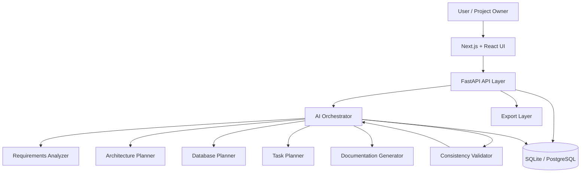
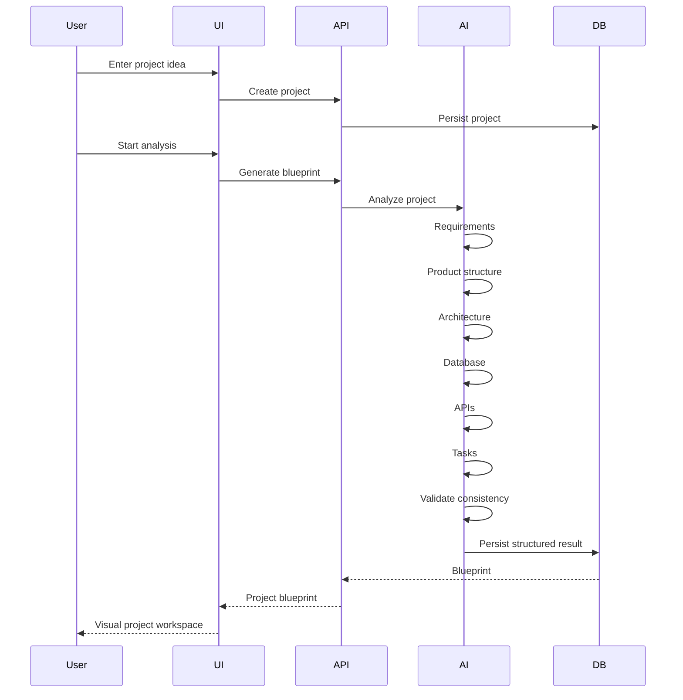
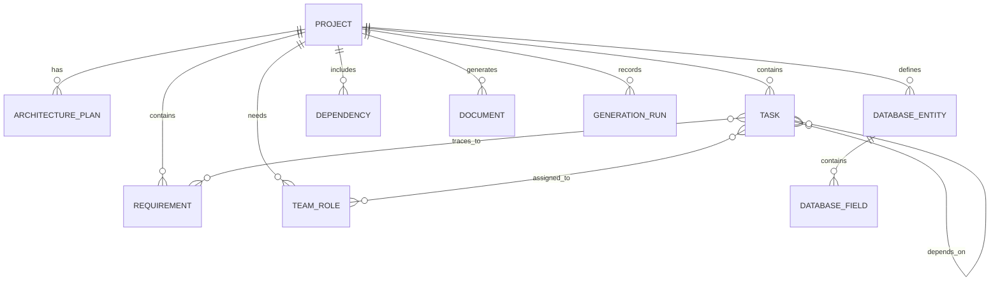

<div align="center">
🧠 AI Project Architect
From an idea → to a structured, traceable, visual software blueprint.
<p>
  <a href="#-overview">Overview</a> •
  <a href="#-capabilities">Capabilities</a> •
  <a href="#-system-architecture">Architecture</a> •
  <a href="#-workflow">Workflow</a> •
  <a href="#-screenshots">Screenshots</a> •
  <a href="#-quick-start">Quick Start</a>
</p>
<p>
  
  
  
  
  
</p>
<p>
  
  
  
  
  
</p>
<br>
> **AI Project Architect is an intelligent software planning workspace that transforms a natural-language project idea into requirements, product structure, architecture, database design, APIs, tasks, teams, dependencies, documentation, diagrams, and exportable project blueprints.**
<br>
<a href="#-screenshots">
  
</a>
<sub>Replace the preview image above with the real dashboard screenshot at <code>docs/screenshots/dashboard.png</code>.</sub>
</div>
---
✨ Why This Project Exists
Turning an idea into a real software system is not only about writing code.
Before implementation, a team needs to understand:
What exactly should the product do?
Who are the users and actors?
What are the functional and non-functional requirements?
How should the product be divided into modules?
What architecture fits the problem?
What data does the system need?
Which APIs and module boundaries are required?
How should work be divided into epics, features, tasks, and subtasks?
Which team roles are needed?
What depends on what?
Can every important requirement be traced into implementation work?
Is the final blueprint internally consistent?
AI Project Architect brings these decisions into one structured workspace.
Instead of producing one large block of AI-generated text, the system creates a connected project model that can be inspected, validated, refined, visualized, documented, and exported.
---
🎯 Overview
<div align="center">
💡 Input	🧠 Intelligence	🏗️ Blueprint	🚀 Delivery
Project Idea	AI Analysis	Architecture	Tasks
Natural Language	Structured Planning	Database	Team
Constraints	Validation	APIs	Dependencies
Goals	Traceability	Diagrams	Documentation
</div>
The core idea
```text
Project Idea
     │
     ▼
┌──────────────────────┐
│ Requirements Analysis│
└──────────┬───────────┘
           ▼
┌──────────────────────┐
│ Product Structure    │
└──────────┬───────────┘
           ▼
┌──────────────────────┐
│ Architecture + Data  │
└──────────┬───────────┘
           ▼
┌──────────────────────┐
│ APIs + Module Design │
└──────────┬───────────┘
           ▼
┌──────────────────────┐
│ Tasks + Team + Deps  │
└──────────┬───────────┘
           ▼
┌──────────────────────┐
│ Docs + Diagrams      │
└──────────┬───────────┘
           ▼
      Project Blueprint
```
---
🧩 Capabilities
<table>
<tr>
<td width="50%" valign="top">
🧠 Requirements Intelligence
Convert a project description into a structured requirements model.
Functional requirements
Non-functional requirements
Actors
Use cases
Assumptions
Constraints
Risks
Priorities
Requirement categories
</td>
<td width="50%" valign="top">
🏗️ Architecture Planning
Move from requirements to a technical system design.
Architecture style
Components
Services
Modules
Responsibilities
Interfaces
Dependencies
Technology recommendations
Architectural rationale
</td>
</tr>
<tr>
<td valign="top">
🗄️ Database Design
Turn domain concepts into a structured data model.
Entities
Fields
Relationships
Primary keys
Foreign keys
Required fields
Indexing considerations
Entity relationships
ER diagrams
</td>
<td valign="top">
🔌 API & Module Planning
Create an implementation-oriented API surface.
Endpoints
HTTP methods
Resources
Module boundaries
Request/response concepts
Ownership
Integration points
API-to-requirement relationships
</td>
</tr>
<tr>
<td valign="top">
📋 Project Decomposition
Break large ideas into manageable implementation work.
Epics
Features
Tasks
Subtasks
Priorities
Estimates
Dependencies
Milestones
Sprint-oriented planning
</td>
<td valign="top">
👥 Team Planning
Connect technical work with people and responsibilities.
Engineering roles
Responsibilities
Ownership
Required skills
Task assignment concepts
Role dependencies
Delivery planning
</td>
</tr>
</table>
---
🔍 The Intelligence Layer
The system is designed around structured AI planning, not simple text generation.
```text
                 ┌─────────────────────┐
                 │   Natural Language  │
                 │    Project Idea     │
                 └──────────┬──────────┘
                            │
                            ▼
                 ┌─────────────────────┐
                 │ Requirements        │
                 │ Analyzer            │
                 └──────────┬──────────┘
                            │
              ┌─────────────┼─────────────┐
              ▼             ▼             ▼
        Product Model   Architecture   Domain Model
              │             │             │
              └─────────────┼─────────────┘
                            ▼
                 ┌─────────────────────┐
                 │ Consistency         │
                 │ Validator           │
                 └──────────┬──────────┘
                            │
                            ▼
                 ┌─────────────────────┐
                 │ Traceability Engine │
                 └──────────┬──────────┘
                            │
                            ▼
                 ┌─────────────────────┐
                 │ Task / Team Planner │
                 └─────────────────────┘
```
AI components
Component	Responsibility
Requirements Analyzer	Extracts and structures requirements
Architecture Planner	Recommends architecture and components
Database Planner	Produces domain entities and relationships
Task Planner	Converts system structure into implementation work
Consistency Validator	Detects structural contradictions
Documentation Generator	Produces technical documentation
Traceability Engine	Connects requirements → design → implementation
The AI layer is provider-independent, so a deterministic mock provider can be used locally while a real LLM adapter can be introduced behind the same interface.
---
🧭 Project Control
AI Project Architect is designed to let a project be viewed from multiple levels.
<div align="center">
IDEA
↓
PRODUCT
↓
REQUIREMENTS
↓
ARCHITECTURE
↓
DATABASE
↓
API
↓
TASKS
↓
TEAM
↓
DELIVERY
</div>
This means a project manager, architect, developer, or technical researcher can inspect the same system from the perspective most relevant to them.
---
🔗 Traceability
One of the most important concepts is traceability.
A requirement should not simply exist as text. It should connect to the design and implementation work derived from it.
```text
Requirement
    │
    ├──────────────► Product Feature
    │
    ├──────────────► Architecture Component
    │
    ├──────────────► Database Entity
    │
    ├──────────────► API Endpoint
    │
    └──────────────► Implementation Task
```
Example
```text
REQ-001
"Students should be able to enroll in courses."

        │
        ├── Feature: Course Enrollment
        │
        ├── Component: Enrollment Service
        │
        ├── Entity: Enrollment
        │
        ├── API: POST /courses/{id}/enroll
        │
        └── Task: Implement enrollment workflow
```
This makes the generated blueprint much easier to audit and reason about.
---
🏛️ System Architecture

---
🔄 End-to-End Workflow

---
🖼️ Screenshots
> Put real application screenshots in `docs/screenshots/`.
> The gallery below is intentionally designed so every preview can be clicked and opened at full resolution.
<div align="center">
<a href="docs/screenshots/dashboard.png">
  
</a>
<a href="docs/screenshots/requirements.png">
  
</a>
<a href="docs/screenshots/architecture.png">
  
</a>
<br>
<a href="docs/screenshots/database.png">
  
</a>
<a href="docs/screenshots/tasks.png">
  
</a>
<a href="docs/screenshots/documentation.png">
  
</a>
</div>
Recommended screenshot set
Preview	File
🏠 Dashboard	`docs/screenshots/dashboard.png`
🧠 Requirements	`docs/screenshots/requirements.png`
🏗️ Architecture	`docs/screenshots/architecture.png`
🗄️ Database	`docs/screenshots/database.png`
📋 Tasks	`docs/screenshots/tasks.png`
📚 Documentation	`docs/screenshots/documentation.png`
GitHub supports repository-hosted images and relative image paths, making this structure portable inside the repository. citeturn0search3turn0search4
---
🧱 Product Modules
<div align="center">
Module	Purpose
🏠 Dashboard	Project overview and generation status
🧠 Requirements	Structured requirements and actors
🧩 Product Structure	Features, modules, and domain organization
🏗️ Architecture	Components, boundaries, and relationships
🗄️ Database	Entities, fields, and relationships
🔌 API Explorer	Planned endpoints and module interfaces
📋 Tasks	Epics, features, tasks, and dependencies
👥 Team	Roles, ownership, and responsibilities
📚 Documentation	Generated technical documentation
📦 Export	Exportable project blueprint
</div>
---
🎨 UI / UX Direction
The interface is designed around a professional engineering workspace rather than a generic AI chat application.
Light Theme
`White` · `Peach` · `Purple`
```text
Primary Background    #FFFDFC
Surface               #FFFFFF
Peach Accent          #F4A6A0
Soft Peach            #FCE2DD
Purple Accent         #8B7BBE
Deep Purple           #5E4A86
Text                  #211F26
Muted Text             #716B78
Border                 #E9E3EA
```
Dark Theme
`Black` · `Yellow`
```text
Background             #0A0A0A
Surface                #111111
Elevated Surface       #181818
Yellow Accent          #F5D547
Soft Yellow            #FFF1A8
Text                   #F5F5F5
Muted Text             #A3A3A3
Border                 #292929
```
The visual language emphasizes hierarchy, information density, clear navigation, subtle interaction feedback, and diagram-friendly layouts.
---
🛠️ Technology Stack
<table>
<tr>
<td>
Backend
Python 3.11+
FastAPI
Pydantic v2
SQLAlchemy 2
Alembic
SQLite
PostgreSQL-ready architecture
</td>
<td>
Frontend
Next.js
React
TypeScript
Tailwind CSS
Responsive application shell
</td>
</tr>
<tr>
<td>
AI
Provider-independent orchestration
Structured AI outputs
Requirements analysis
Architecture planning
Database planning
Task planning
Consistency validation
</td>
<td>
Visualization
Mermaid
Architecture diagrams
ER diagrams
Workflow diagrams
Traceability views
Exportable documentation
</td>
</tr>
</table>
---
📡 API Surface
```text
/api/v1
│
├── POST   /projects
├── GET    /projects
├── GET    /projects/{project_id}
├── DELETE /projects/{project_id}
│
├── POST   /projects/{project_id}/analyze
│
├── GET    /projects/{project_id}/requirements
├── GET    /projects/{project_id}/architecture
├── GET    /projects/{project_id}/database
├── GET    /projects/{project_id}/tasks
├── POST   /projects/{project_id}/tasks/regenerate
├── GET    /projects/{project_id}/documentation
├── GET    /projects/{project_id}/export
├── GET    /projects/{project_id}/generation-runs
│
└── GET    /health
```
---
🗃️ Data Model

---
🧪 Validation & Reliability
The system is designed to validate generated structures rather than blindly trusting AI output.
Current validation concepts
Typed Pydantic outputs
Structured generation
Input validation
Output validation
Requirement-to-task coverage
Entity usage checks
Role validation
Required-field validation
Dependency cycle detection
Persistence checks
Reference integrity
Safe export handling
Explicit assumptions
Limited retries
---
🔐 Security Principles
Even though the project is currently focused on local development and portfolio use, its architecture follows strong engineering principles.
No secrets committed to Git
Environment-variable based configuration
Restricted CORS
ORM / parameterized database access
Generated content treated as untrusted
Prompt-injection awareness
Safe filename handling
No arbitrary shell execution from generated text
Input size and format validation
Rate-limit-ready architecture
---
🚀 Quick Start
<details>
<summary><strong>1. Clone the repository</strong></summary>
```bash
git clone <YOUR_REPOSITORY_URL>
cd <YOUR_REPOSITORY_DIRECTORY>
```
</details>
<details>
<summary><strong>2. Start the backend</strong></summary>
```bash
cd backend
python -m venv .venv
```
Activate the environment and install the backend dependencies according to the repository's current setup.
Then start FastAPI using the project's documented command.
</details>
<details>
<summary><strong>3. Start the frontend</strong></summary>
```bash
cd frontend
npm install
npm run dev
```
</details>
<details>
<summary><strong>4. Open the application</strong></summary>
Open the local frontend URL shown by Next.js.
Then:
```text
Create Project
      ↓
Enter Project Idea
      ↓
Generate Blueprint
      ↓
Review Requirements
      ↓
Inspect Architecture
      ↓
Inspect Database
      ↓
Explore APIs
      ↓
Review Tasks & Team
      ↓
Open Documentation
      ↓
Export Blueprint
```
</details>
> Exact commands should always follow the repository's current README and environment configuration.
---
🧪 Example Project
University Course Management System
Input:
> Build a university platform where students can discover courses, enroll in classes, instructors manage course content, and administrators manage academic data.
The system can derive:
```text
Users
├── Student
├── Instructor
└── Administrator

Features
├── Course Catalog
├── Enrollment
├── Course Management
├── Academic Records
└── Administration

Architecture
├── User Module
├── Course Module
├── Enrollment Module
├── Academic Module
└── Administration Module

Database
├── User
├── Course
├── Enrollment
├── Instructor
└── AcademicRecord

Tasks
├── Design enrollment workflow
├── Implement course API
├── Create enrollment schema
├── Implement authorization
└── Build course dashboard
```
The important part is not simply generating these objects — it is maintaining relationships between them.
---
🍔 Second Example: Food Delivery
A second domain can test whether the intelligence layer generalizes beyond academic systems.
```text
Customer
Restaurant
Courier
Order
Menu
Payment
Delivery
Notification
```
Possible architecture:
```text
Customer App
     │
     ▼
API Gateway
     │
 ┌───┼───────────────┐
 ▼   ▼               ▼
Order Service   Restaurant   Payment
                     │
                     ▼
                Delivery
                     │
                     ▼
                Notification
```
---
📊 What Makes It Different?
Traditional AI Generator	AI Project Architect
Generates text	Generates structured project models
One-shot output	Connected planning workflow
Hard to validate	Consistency validation
Requirements isolated	Traceable requirements
Generic architecture	Domain-aware architecture planning
Manual task breakdown	Structured decomposition
No project relationships	Requirements → design → tasks
Chat-oriented	Engineering workspace
Static explanation	Visual project blueprint
---
🗺️ Roadmap
```text
                         ┌──────────────────────┐
                         │     Current MVP      │
                         └──────────┬───────────┘
                                    │
                  ┌─────────────────┼─────────────────┐
                  ▼                 ▼                 ▼
            Real LLMs         Rich Diagrams     Editable Plans
                  │                 │                 │
                  └─────────────────┼─────────────────┘
                                    ▼
                           GitHub Repository
                                Analysis
                                    │
                                    ▼
                         Engineering Intelligence
                                    │
                                    ▼
                           Collaboration Layer
                                    │
                                    ▼
                         Enterprise Workflows
```
Planned directions
Real LLM providers
Streaming generation
Rich interactive diagrams
Editable generated plans
Authentication
Project ownership
Team collaboration
Templates
GitHub import
Repository analysis
Architecture drift detection
Issue planning
Pull-request planning
Autonomous engineering workflows
Enterprise-oriented controls
---
🧠 Long-Term Vision
The long-term goal is to move beyond:
> **"Generate me a software architecture."**
toward:
> **"Understand this project, reason about its structure, keep its plan consistent, monitor implementation drift, and help the team move from idea to execution."**
That means AI Project Architect can evolve into an intelligent engineering control layer connecting:
```text
Idea
 ↓
Requirements
 ↓
Product
 ↓
Architecture
 ↓
Data
 ↓
APIs
 ↓
Implementation
 ↓
Tasks
 ↓
Team
 ↓
Repository
 ↓
Issues
 ↓
Pull Requests
 ↓
Project Intelligence
```
---
📁 Suggested Repository Structure
```text
AI-Project-Architect/
│
├── backend/
│   ├── app/
│   ├── tests/
│   ├── alembic/
│   └── requirements/
│
├── frontend/
│   ├── app/
│   ├── components/
│   ├── lib/
│   └── public/
│
├── docs/
│   ├── screenshots/
│   │   ├── dashboard.png
│   │   ├── requirements.png
│   │   ├── architecture.png
│   │   ├── database.png
│   │   ├── tasks.png
│   │   └── documentation.png
│   └── diagrams/
│
├── README.md
├── LICENSE
└── .gitignore
```
---
📚 Documentation Strategy
The README provides the high-level product story.
Detailed technical material can live separately:
```text
README.md
│
├── Product overview
├── Visual showcase
├── Architecture
├── Capabilities
└── Quick Start

docs/
│
├── architecture.md
├── api.md
├── ai-system.md
├── testing.md
├── deployment.md
└── screenshots/
```
For a GitHub repository, keeping the main README focused while moving very long technical documentation into `docs/` keeps the landing page cleaner. GitHub also provides an automatic outline for headings in rendered Markdown. citeturn0search4
---
🧭 Navigation
<div align="center">
⬆ Back to Top ·
🧠 Capabilities ·
🏗️ Architecture ·
🖼️ Screenshots ·
🚀 Quick Start ·
🗺️ Roadmap
</div>
---
⭐ Project Philosophy
> **Good software starts with a clear model of the problem.**
AI Project Architect is built around the idea that AI should not only produce answers.
It should help teams structure problems, connect decisions, expose dependencies, validate assumptions, and turn ideas into executable engineering plans.
---
<div align="center">
🧠 AI Project Architect
Understand the idea.  
Design the system.  
Organize the work.  
Control the project.
<br>
⭐ If this project is useful or interesting, consider starring the repository.
</div>
