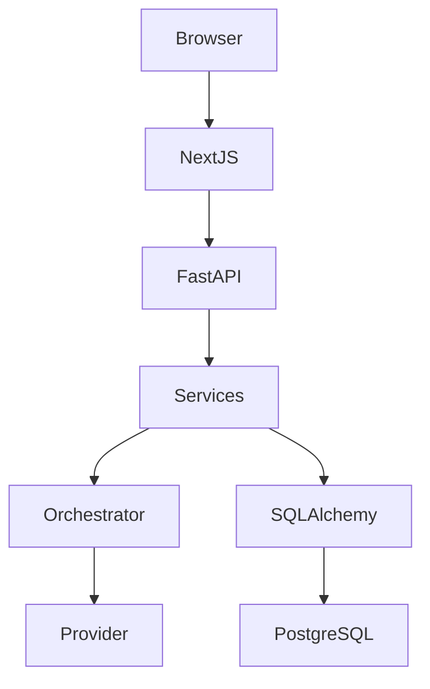

# Architecture

The MVP is a modular monolith. HTTP routers validate and translate requests, application services own workflows, the planning orchestrator runs explicit stages, and SQLAlchemy persists validated results.

The provider interface supports a deterministic `MockAIProvider` and an isolated `RealLLMProvider`. Every blueprint is parsed through Pydantic and checked for valid roles, references, and acyclic task dependencies before persistence.

