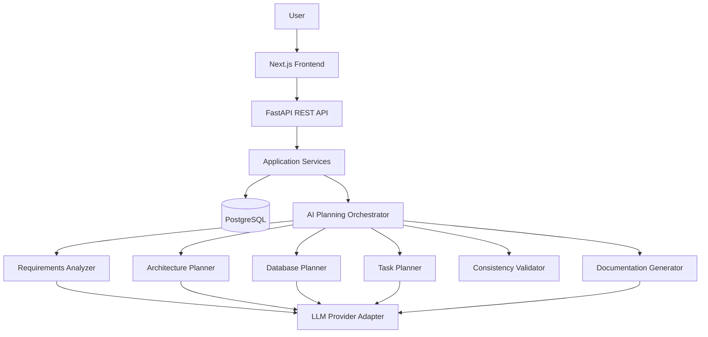

# System Architecture

## Style
Use a **modular monolith** for the MVP. This keeps deployment and learning simple while preserving clear module boundaries.

## High-Level Flow

## Layering
Presentation → Application Services → Domain/Data → AI → Infrastructure.

API routers must not directly call an LLM provider.

Use:
`Router → Service → Orchestrator → Planner → Provider`

## Generation Run
Track queued/running/completed/failed runs with safe metadata and error summaries.

## Future Extension Points
- authentication
- organizations
- background workers
- Redis
- GitHub integration
- repository analysis
- collaborative workspaces
- multi-agent execution
- observability
- deployment automation

Do not implement these prematurely.
